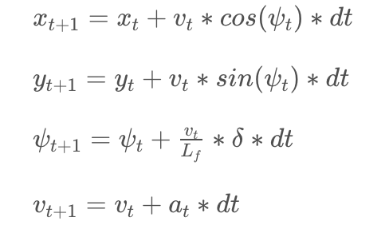
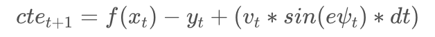

# udacity-carnd-model-predictive-control
Model Predictive Control project for Udacity Term2


## Understanding Implementing Model Predictive Control (MPC)
An improvement over PID controller can be achieved by trying to capture a model that describes movements of a vehicle.
One can visualize the the state of a vehicle initially i.e. its position in an x,y plane, a driving direction and a velocity.
An important addition to this state is the cross-track error and an angle error which helps us define and implement the model predictive controller. Here are the equations (from Udacity's learning resources):





Here, the state of the vehicle is given by the position `(x,y)`, the current angle `psi` and the velocity `v`.
The actuators are the acceleration/deceleration `a` and the steering angle `delta`.

`cte` is the cross-track error and `epsi` is the difference of the reference angle to the current angle.

Each update takes the time delta `dt` into account - the higher `dt`, the larger the changes between updates will be.

### Choosing `N` and `dt`
An important step in the implementation of MPC is choosing the number of points we want to calculate (or timesteps) represented by `N` and the time difference between those points `dt`. This helps us define how far in future can we look (known as Horizon) represented by `T`. T can be calculated by multiplying N & dt (`N * dt`)

In general, we want to choose smaller `N` and a higher `dt` so the prediction by Ipopt can be done in a reasonable amount
of time, while still providing the accuracy we need to steer the vehicle.

In my first trial I started with `N=30, dt=0.05`, which lead to longer time for calculation. Then after some fine-tuning and also help from community on slack, I switched to `N=10, dt=0.1`, which seemed to be a good trade-off and also matched the latency of 0.1 seconds which was added later.

### Polynomial fitting and Transforming the reference track co-ordinates

This took me some time, but thanks to help from my fellow students and bit of reading, I was able to figure this step out. The simulator gives us points of the reference track in absolute coordinates. I transformed these to be relative to the location of the vehicle, which you can see in [Utils](src/utils.cpp#L75) and [Main](src/main.cpp#L77)
Once this was done - I fitted a 3rd order polynomial to these points, which you can see [here](src/main.cpp#78).

### Choosing weights for the MPC cost function

I defined a [cost function](src/MPC.cpp#L56-L84) and added weights to the different parts of the cost function using these rules as specified in the class videos and resources.

- In general a higher `cte` or `psi` should lead to a larger cost.
- Speed should be de-prioritized against staying on track. So smaller values can be used
- In general we want to steer and throttle as less as possible.
- The changes between steering angles of all timesteps should be as small as possible.
- Secondary to steering angle, the changes between throttling of all timesteps should be small

### Latency
To predict the vehicle state post expected latency, I just had to call the update equations again on the state given by the simulator.
After starting with a 100ms latency value and some trials, I thought, I got better results with adding about 20-30ms to this value (finally chose 120ms - 100ms for latency and 20ms for calculation in MPC implementation).

### Final product


### Improvements and Learnings

- I certainly think my code can be improved. I already refactored plenty of code into my utils class, but I am sure a few improvements are possible after another pass.
- Due to following some conversations and learnings from my fellow students, I ended up implementing some parameters differently, which ended up taking me a longer time to debug my code For ex: The computes in my MPC equations are based on params with a different sign versus what is returned by the simulator - so this positive, negative conversion was very important and I had to convert the signs both the times - while retrieving and publishing from the simulator
Another such conversion was from miles/hour to meters/second
- Also, this being the final project, I need to now go back and review how well the all the learnings from this term line up (This was mathematically a heavy term for me). That should definitely be quite exciting.


### A Side Note:
Fellow students and the community on slack and forums have been very helpful for this project and through out the term.

---

## Dependencies

* cmake >= 3.5
 * All OSes: [click here for installation instructions](https://cmake.org/install/)
* make >= 4.1
  * Linux: make is installed by default on most Linux distros
  * Mac: [install Xcode command line tools to get make](https://developer.apple.com/xcode/features/)
  * Windows: [Click here for installation instructions](http://gnuwin32.sourceforge.net/packages/make.htm)
* gcc/g++ >= 5.4
  * Linux: gcc / g++ is installed by default on most Linux distros
  * Mac: same deal as make - [install Xcode command line tools]((https://developer.apple.com/xcode/features/)
  * Windows: recommend using [MinGW](http://www.mingw.org/)
* [uWebSockets](https://github.com/uWebSockets/uWebSockets)
  * Run either `install-mac.sh` or `install-ubuntu.sh`.
  * If you install from source, checkout to commit `e94b6e1`, i.e.
    ```
    git clone https://github.com/uWebSockets/uWebSockets
    cd uWebSockets
    git checkout e94b6e1
    ```
    Some function signatures have changed in v0.14.x. See [this PR](https://github.com/udacity/CarND-MPC-Project/pull/3) for more details.
* Fortran Compiler
  * Mac: `brew install gcc` (might not be required)
  * Linux: `sudo apt-get install gfortran`. Additionall you have also have to install gcc and g++, `sudo apt-get install gcc g++`. Look in [this Dockerfile](https://github.com/udacity/CarND-MPC-Quizzes/blob/master/Dockerfile) for more info.
* [Ipopt](https://projects.coin-or.org/Ipopt)
  * Mac: `brew install ipopt`
       +  Some Mac users have experienced the following error:
       ```
       Listening to port 4567
       Connected!!!
       mpc(4561,0x7ffff1eed3c0) malloc: *** error for object 0x7f911e007600: incorrect checksum for freed object
       - object was probably modified after being freed.
       *** set a breakpoint in malloc_error_break to debug
       ```
       
       This error has been resolved by updrading ipopt with
       ```brew upgrade ipopt --with-openblas```
       per this [forum post](https://discussions.udacity.com/t/incorrect-checksum-for-freed-object/313433/19).

* [CppAD](https://www.coin-or.org/CppAD/)
  * Mac: `brew install cppad`
  * Linux `sudo apt-get install cppad` or equivalent.
  * Windows: TODO. If you can use the Linux subsystem and follow the Linux instructions.
* [Eigen](http://eigen.tuxfamily.org/index.php?title=Main_Page). This is already part of the repo so you shouldn't have to worry about it.
* Simulator. You can download these from the [releases tab](https://github.com/udacity/self-driving-car-sim/releases).
* Not a dependency but read the [DATA.md](./DATA.md) for a description of the data sent back from the simulator.


## Basic Build Instructions


1. Clone this repo.
2. Make a build directory: `mkdir build && cd build`
3. Compile: `cmake .. && make`
4. Run it: `./mpc`.

## Tips

1. It's recommended to test the MPC on basic examples to see if your implementation behaves as desired. One possible example
is the vehicle starting offset of a straight line (reference). If the MPC implementation is correct, after some number of timesteps
(not too many) it should find and track the reference line.
2. The `lake_track_waypoints.csv` file has the waypoints of the lake track. You could use this to fit polynomials and points and see of how well your model tracks curve. NOTE: This file might be not completely in sync with the simulator so your solution should NOT depend on it.
3. For visualization this C++ [matplotlib wrapper](https://github.com/lava/matplotlib-cpp) could be helpful.
